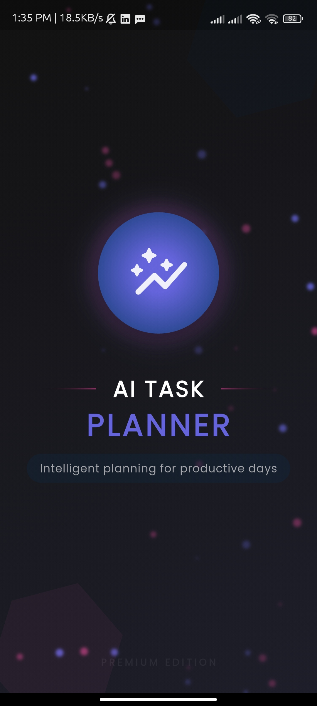
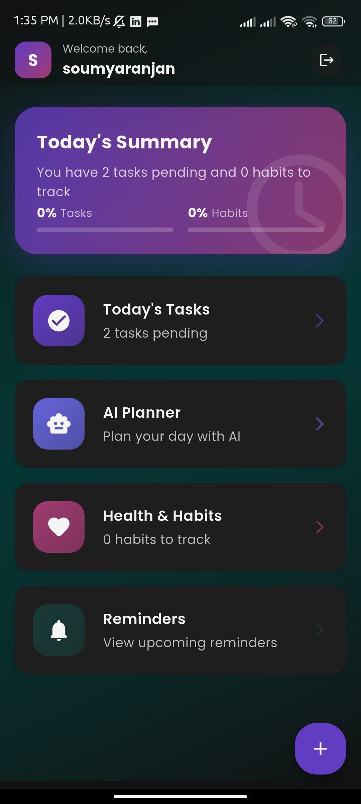
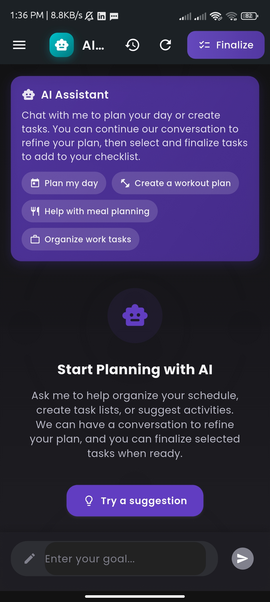
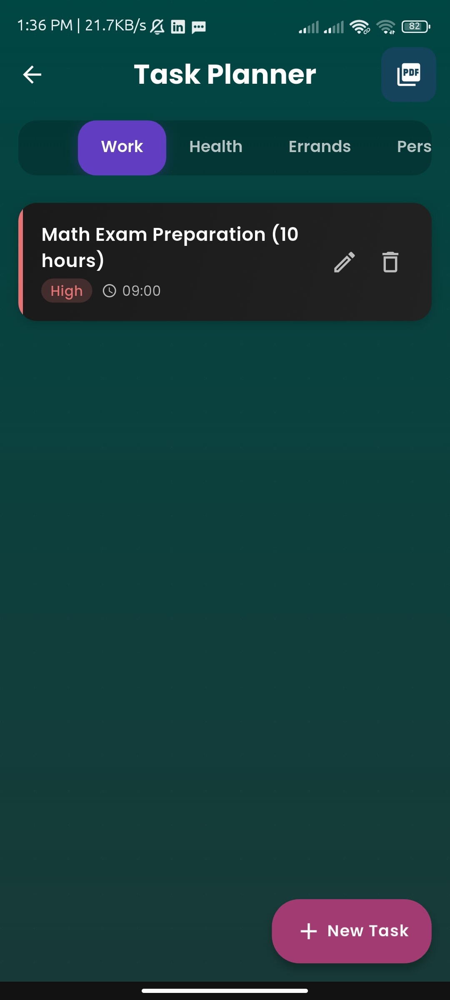
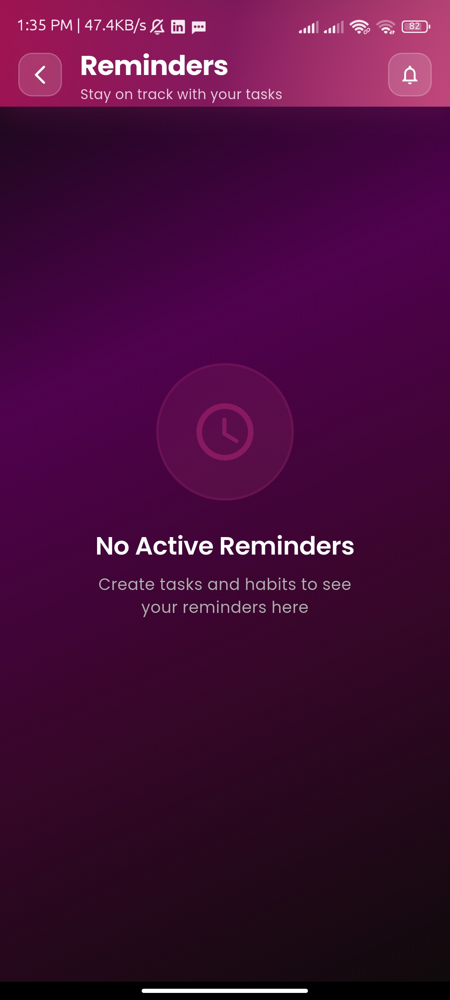
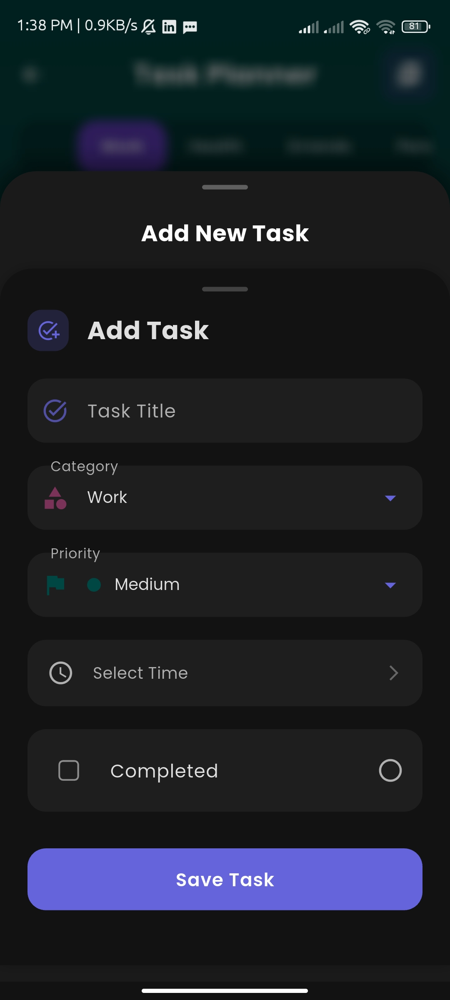

# TimeTide

**AI-Powered Daily Task Planner and Reminder App** built with Flutter and Firebase. TimeTide streamlines task management with intelligent planning, smart reminders, and a visually appealing interface designed to boost productivity and well-being.

## App Showcase

| Splash Screen | Home Dashboard | AI Planner |
|:-------------:|:-------------:|:-------------:|
|  |  |  |
| *Elegant splash with animated wave gradient* | *Personalized greeting and quick access cards* | *Conversational AI planning interface* |

| Checklist Builder | Reminder Setup | Task Card |
|:-----------------:|:--------------:|:---------:|
|  |  |  |
| *Drag-and-drop task organization* | *Smart, configurable reminders* | *Interactive task cards with color tags* |

## Features

TimeTide offers a robust set of features to enhance productivity and organization:

- **AI-Powered Planning**: Leverage the Google Gemini API to generate optimized daily and weekly plans based on user goals, preferences, and past behavior.
- **Intelligent Task Management**: Create, edit, and organize tasks with drag-and-drop functionality, categorized into Work, Personal, Health, and Errands.
- **Smart Reminders**: Receive time-based, location-based, and AI-suggested rescheduling notifications to stay on track.
- **Progress & Habit Tracking**: Monitor task completion and build habit streaks with visual analytics (circular graphs, bars, and streak trackers).
- **Seamless Calendar Integration**: View tasks in a monthly grid with optional Google Calendar sync.
- **PDF Export**: Export plans and checklists in styled formats (Minimal, Colorful, Iconic) for record-keeping or sharing.
- **Beautiful UI**: Fluid animations, Material 3 design, and a custom Poppins font for a delightful user experience.

## What Makes TimeTide Special?

TimeTide stands out with its unique blend of intelligence and user-centric design:

1. **AI-Driven Optimization**: Analyzes productivity patterns to suggest optimal task schedules and priorities.
2. **Fluid & Engaging UI**: Custom Lottie animations and smooth transitions create a delightful experience.
3. **Context-Aware Scheduling**: Adjusts tasks based on location, time, and available slots.
4. **Mental Well-Being Focus**: Incorporates breaks and workload balancing to prevent burnout.
5. **Learning Algorithm**: Improves suggestions over time based on user habits and preferences.

## Current Development Status

- ✅ Core UI implementation with Jetpack Compose-inspired Flutter widgets
- ✅ Firebase integration (Authentication, Firestore, Storage)
- ✅ Authentication flows (Google Sign-In, Email/Password, Guest Mode)
- ✅ Basic task management and checklist builder
- 🔄 AI planning features (Google Gemini API integration in progress)
- 🔄 Calendar integration (Google Calendar sync in progress)
- 📅 Analytics dashboard (planned)
- 📅 Advanced sharing features (planned)

## Architecture

TimeTide follows a clean, modular architecture for maintainability and scalability:

- **Feature-Based Structure**: Each feature (e.g., onboarding, planner, reminders) is organized into separate modules.
- **Data-Provider-UI Layers**: Separates data handling, business logic, and UI for clarity.
- **Provider State Management**: Efficient state management using the Provider package.
- **Firebase Backend**: Handles authentication, real-time data storage, and analytics.

## Getting Started

### Prerequisites

- Flutter SDK 3.10+
- Dart 3.0+
- Firebase account
- Google Gemini API key

### Development Setup

1. **Clone the Repository**:
   ```
   git clone https://github.com/i-soumya18/timetide.git
   ```

2. **Install Dependencies**:
   ```
   flutter pub get
   ```

3. **Set Up Firebase**:
   - Create a Firebase project in the Firebase Console.
   - Add Android and iOS apps to the project.
   - Download `google-services.json` (Android) and `GoogleService-Info.plist` (iOS).
   - Enable Authentication (Google Sign-In, Email/Password), Firestore, and Storage.

4. **Configure Gemini API**:
   - Obtain an API key from Google AI Studio.
   - Store the key securely in environment variables or a configuration file.

5. **Run the App**:
   ```
   flutter run
   ```

### Building for Production

```bash
flutter build apk --release
flutter build ios --release
```

## Project Structure

```
timetide/
├── assets/                          # Static assets
│   ├── fonts/                       # Poppins font family
│   ├── images/                      # UI images (splash, home, patterns)
│   └── lottie/                      # Lottie animation files
├── lib/                             # Source code
│   ├── core/                        # Core utilities (theme, constants)
│   ├── features/                    # Feature modules (onboarding, planner, etc.)
│   ├── models/                      # Data models (tasks, reminders, habits)
│   ├── services/                    # Services (Firebase, Gemini API)
│   ├── templates/                   # Reusable UI templates
│   ├── widgets/                     # Shared UI components
│   ├── firebase_options.dart        # Firebase configuration
│   ├── main.dart                    # App entry point
│   └── onboarding_screen.dart       # Onboarding flow
├── test/                            # Unit and widget tests
└── [Platform folders]               # Android/iOS native integrations
```

## Authentication Options

| Google Sign-In |
|:--------------:|
|  |
| *Secure and seamless Google Sign-In* |

- **Google Sign-In**: Quick and secure authentication.
- **Email/Password**: Traditional login option.
- **Guest Mode**: Limited features without cloud sync.

## Technology Stack

- **Frontend**: Flutter with Material Design 3
- **State Management**: Provider for efficient state handling
- **Backend**: Firebase (Authentication, Firestore, Storage, Analytics, Crashlytics)
- **AI Integration**: Google Gemini API for intelligent planning
- **Animations**: Lottie for engaging micro-interactions
- **Notifications**: Flutter Local Notifications for reminders
- **Offline Support**: SQLite database with synchronization
- **UI Design**: Custom theme with Poppins font, Material 3 colors (#219EBC, #8ECAE6, #FFB703)

## UI Design Guidelines

- **Fonts**: Poppins for readability, JetBrains Mono for AI-generated plans.
- **Colors**: Primary blue (#219EBC), secondary cyan (#8ECAE6), accent yellow (#FFB703).
- **Icons**: Material Icons Extended, Lucide, Tabler for task categorization.
- **Animations**: Lottie for AI effects, smooth Compose-inspired transitions.
- **Shapes**: Rounded corners (24dp radius) for a modern look.
- **Dark Mode**: Soft contrast for accessibility and elegance.

## Firebase Structure

| Collection      | Description                                      |
|-----------------|--------------------------------------------------|
| `users`         | User profiles (ID, name, avatar, preferences)    |
| `tasks`         | Task details (title, category, time, priority)   |
| `plannerChats`  | AI chat history (messages, timestamps)           |
| `reminders`     | Reminder settings (task ID, time, type, repeat)  |
| `habits`        | Habit tracking (name, streak, user ID)           |
| `settings`      | User preferences (theme, language, notifications)|

## Contributing

Contributions are welcome! Please submit a Pull Request with detailed descriptions of your changes.

## License

This project is licensed under the MIT License - see the [LICENSE](LICENSE) file for details.
